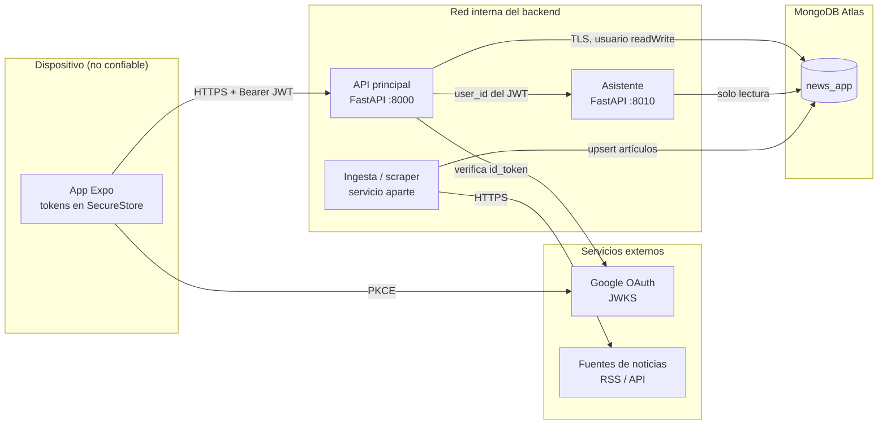
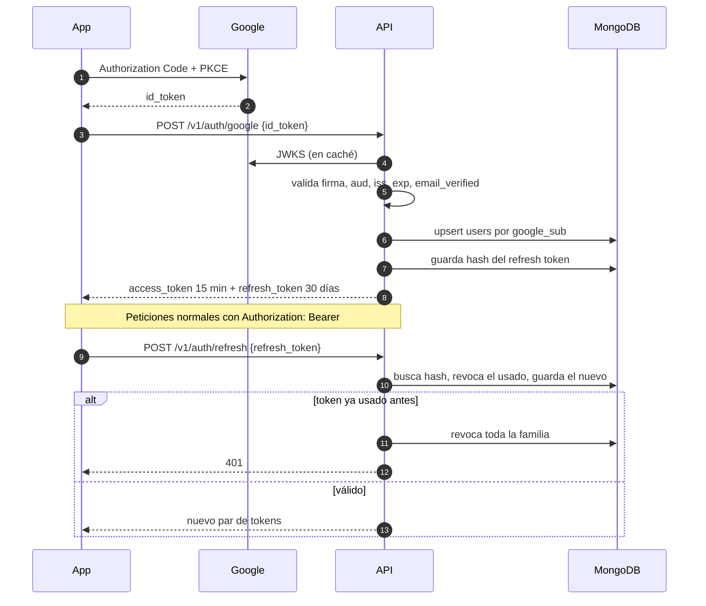
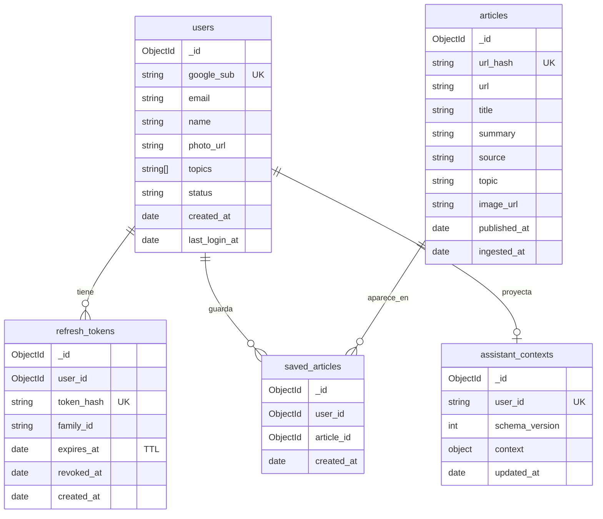

# Arquitectura

Estado: propuesta v1 (2026-10-03). Cubre la API principal. El asistente (`backend/assistant`) lo
mantiene otro integrante; aquí solo aparece como dependencia.

## Componentes y límites de confianza

La app móvil solo habla con la API principal. La API es el único componente que conoce la identidad
del usuario, escribe en MongoDB y llama al asistente por la red interna.

| Límite | Regla |
|---|---|
| App a API | Todo dato del cliente se valida. El `user_id` nunca viaja en el cuerpo: sale del JWT. |
| API a Google | La firma, `aud`, `iss`, `exp` y `email_verified` del `id_token` se validan en el servidor. |
| API a asistente | Red privada. El puerto 8010 no se publica fuera de Docker. |
| API a MongoDB | Usuario de base de datos con `readWrite` solo sobre `news_app`. TLS obligatorio. IP en lista de acceso. |
| Ingesta a fuentes | Solo URLs de una lista fija de fuentes. Tiempo máximo y tamaño máximo por respuesta. Detalle en [ingesta.md](ingesta.md). |

## Inicio de sesión y renovación

La app ya obtiene el código de Google con PKCE. El cambio es enviar el `id_token` a la API en vez de
usar el `access_token` de Google para leer el perfil desde el teléfono.

El modo invitado no crea cuenta. Puede leer `GET /v1/news` sin token y no accede a preferencias,
guardados ni chat.

## Modelo de datos

Base `news_app`. Los campos marcados como índice se crean al iniciar la API.

| Colección | Índices |
|---|---|
| `users` | `{google_sub: 1}` único |
| `refresh_tokens` | `{token_hash: 1}` único, `{family_id: 1}`, `{expires_at: 1}` TTL |
| `articles` | `{url_hash: 1}` único, `{published_at: -1, _id: -1}`, `{topic: 1, published_at: -1}` |
| `saved_articles` | `{user_id: 1, article_id: 1}` único, `{user_id: 1, created_at: -1}` |
| `assistant_contexts` | `{user_id: 1}` único. Lo escribe la API, lo lee el asistente. |

`assistant_contexts` sigue el esquema de `backend/assistant/docs/database.md`. Su contenido
(nombre, temas, últimos guardados) se acuerda con quien mantiene el asistente.
