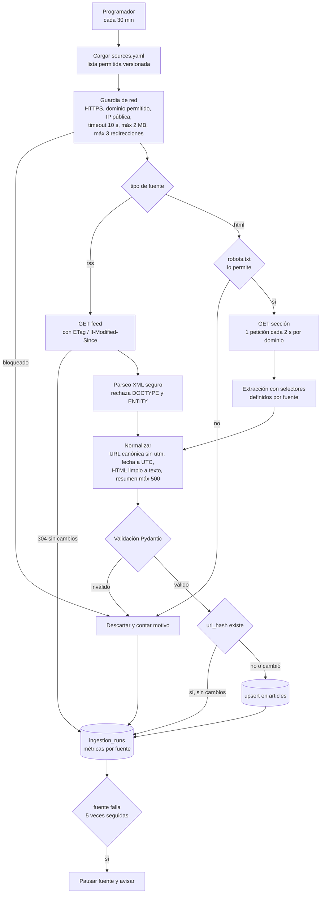

# Ingesta de noticias

Estado: propuesta v1 (2026-10-03). Servicio `backend/services/ingest`, separado de la API.

## Estrategia

RSS primero, scraper HTML solo como respaldo. Casi todos los medios publican RSS. Es más estable
que el HTML, pesa menos y ya trae título, enlace, fecha y resumen. El scraper HTML se escribe por
fuente únicamente cuando el medio no tiene RSS.

Se guarda título, resumen corto, fecha, fuente y enlace al original. El texto completo no se
guarda: reduce riesgo de derechos de autor y el feed enlaza al medio.

## Flujo



## Validación de cada artículo

El modelo Pydantic rechaza el artículo completo si un campo no cumple.

| Campo | Regla |
|---|---|
| `title` | Texto plano, 10 a 300 caracteres después de limpiar HTML. |
| `url` | `https`, dominio igual al de la fuente o a uno de sus dominios declarados. Sin credenciales en la URL. Máx 2048. |
| `summary` | Texto plano sin HTML, recortado a 500 caracteres. Si falta, se usa la meta `description` o queda vacío. |
| `source` | Viene de `sources.yaml`, nunca del contenido descargado. |
| `topic` | Uno de la lista cerrada (`nacional`, `economia`, `tecnologia`, `deportes`, `internacional`, `cultura`). Sale de la categoría del feed o de la fuente. |
| `published_at` | Fecha con zona horaria, no más de 1 hora en el futuro ni más de 30 días en el pasado. |
| `image_url` | Opcional. Solo `https`. Se guarda como enlace, no se descarga. |

## Controles de seguridad

| Riesgo | Control |
|---|---|
| SSRF | Solo dominios de `sources.yaml`. Se resuelve el DNS y se bloquean IPs privadas, loopback y link-local. Cada redirección se vuelve a validar. |
| XML malicioso (XXE, billion laughs) | Se rechaza cualquier documento con `DOCTYPE` o `ENTITY` usando `defusedxml` antes de `feedparser`. `feedparser` nunca descarga por su cuenta: recibe los bytes ya validados. |
| Respuestas enormes o lentas | Lectura en streaming con corte a 2 MB. Timeout total de 10 s. |
| HTML o scripts inyectados | `nh3` elimina todas las etiquetas. A Mongo solo llega texto plano. La app nunca renderiza HTML de fuentes. |
| Inyección NoSQL | Los valores pasan por Pydantic y se escriben como valores, nunca como claves u operadores. |
| Prompt injection hacia el agente | El texto de noticias se marca como dato no confiable al pasarlo al asistente. |
| Abuso hacia los medios | `User-Agent` propio con contacto, respeta `robots.txt`, peticiones condicionales y 1 petición cada 2 s por dominio. |
| Permisos en la base | Usuario de Mongo propio del scraper con rol personalizado: `insert`, `update` y `find` solo en `articles` e `ingestion_runs`. |
| Dependencias | Versiones fijadas y `pip-audit` en CI. |

## Archivo de fuentes

`backend/services/ingest/sources.yaml` se versiona en git. Agregar una fuente es un cambio revisado
en un pull request, no un dato editable desde la app.

```yaml
- id: ejemplo-rss
  name: Medio de ejemplo
  type: rss
  url: https://www.ejemplo.com/feed/
  allowed_domains: [ejemplo.com, www.ejemplo.com]
  default_topic: nacional
  enabled: true

- id: ejemplo-html
  name: Medio sin RSS
  type: html
  url: https://www.otro.com/economia
  allowed_domains: [otro.com, www.otro.com]
  default_topic: economia
  selectors:
    item: "article.card"
    title: "h2 a"
    link: "h2 a@href"
    summary: "p.excerpt"
    date: "time@datetime"
  enabled: true
```

## Colección `ingestion_runs`

Un documento por fuente y ejecución. Sirve para ver qué fuente falla y por qué.

```json
{
  "source_id": "ejemplo-rss",
  "started_at": "2026-10-03T22:00:00Z",
  "finished_at": "2026-10-03T22:00:03Z",
  "status": "ok | not_modified | error | paused",
  "http_status": 200,
  "fetched": 30,
  "inserted": 4,
  "updated": 1,
  "rejected": { "invalid_date": 2, "domain_mismatch": 0 },
  "error": null
}
```

Índices: `{source_id: 1, started_at: -1}` y TTL de 30 días sobre `started_at`.

## Librerías previstas

`httpx`, `feedparser`, `defusedxml`, `nh3`, `selectolax`, `pydantic`, `pyyaml` y `pymongo`.
`robots.txt` se lee con `urllib.robotparser` de la librería estándar.
